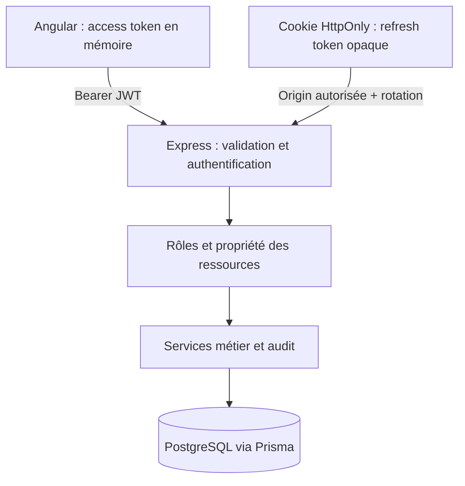

# Support Desk

Une application full stack de gestion de tickets, conçue pour rendre les mécanismes de sécurité lisibles et vérifiables. Un client ouvre une demande, un agent la prend en charge et l’administrateur contrôle les accès. Les conversations publiques et les notes internes restent séparées jusque dans les requêtes SQL.

Projet de portfolio pédagogique sous licence MIT. Il ne constitue pas une garantie de sécurité ni une plateforme prête pour des données sensibles.

## Fonctionnalités

- Inscription client, connexion Argon2id, JWT de 10 minutes et sessions de 7 jours.
- Rotation atomique du refresh token, détection de réutilisation et révocation immédiate.
- Gestion des sessions personnelles, révocation globale et administration des comptes.
- Tickets paginés, recherche par sujet/description, filtres statut/priorité/attribution.
- Prise en charge, réattribution, transitions de statut, réponses et notes internes.
- Journal d’audit réservé aux administrateurs.
- Interface française responsive, formulaires réactifs, notifications accessibles, clavier et focus visibles.

## Rôles

| Rôle     | Périmètre                                                                              |
| -------- | -------------------------------------------------------------------------------------- |
| CUSTOMER | Créer et lire ses tickets, répondre publiquement, fermer après résolution              |
| AGENT    | Lire les tickets non attribués et les siens, prendre en charge puis traiter les siens  |
| ADMIN    | Tous les tickets, réattribution, utilisateurs, rôles, désactivation, sessions et audit |

La [matrice détaillée](docs/authorization-matrix.md) décrit les contrôles de propriété et les transitions. L’API reste la seule autorité : cacher un bouton ou utiliser un guard ne protège pas une ressource.

## Technologies et architecture

Node.js 24 LTS, TypeScript strict, Express 5, PostgreSQL, Prisma 7 avec adaptateur `pg`, Zod, `jose`, Argon2id, OpenAPI 3.1. Frontend Angular 22.2, composants autonomes, Router, HttpClient, Reactive Forms, signals, RxJS et SCSS. Vitest, Supertest, Playwright, ESLint et Prettier. Versions résolues dans `package-lock.json`.

```text
apps/api/              API Express, Prisma, tests HTTP
  src/config/          Validation de la configuration
  src/database/        Client Prisma
  src/middlewares/     Authentification, rôles, origines, limites
  src/security/        Signature et vérification JWT, secrets opaques
  src/modules/         Auth, utilisateurs, tickets et audit
  src/shared/          Erreurs et validation communes
  prisma/              Schéma, migration SQL, seed
apps/web/              Angular, interface et tests
packages/contracts/    Types DTO sans Express ni Prisma
e2e/                   Parcours navigateur
scripts/               Configuration et PostgreSQL local facultatif
docs/                  Sécurité, autorisations, architecture et validation
```



Les rôles ne sont pas embarqués dans le JWT : l’API lit le compte et la session en base à chaque requête. Cette décision facilite l’invalidation immédiate et évite des droits périmés.

## Prérequis

- Node.js **24.15 ou supérieur dans la branche 24**, npm 11.
- Docker avec Compose pour PostgreSQL 17, ou l’alternative locale ci-dessous.
- Git. Chromium est installé séparément pour Playwright.

Toutes les commandes suivantes partent de la racine du dépôt. Ne publiez jamais les fichiers `.env`.

## Installation et configuration

```sh
npm ci
```

### Option A — Docker Compose

Copier `.env.example` vers `.env`, puis `apps/api/.env.example` vers `apps/api/.env`. Remplacer les valeurs d’exemple : même mot de passe PostgreSQL dans les URL et Compose, secret JWT aléatoire, phrase de passe de démonstration de 12 à 128 caractères.

```sh
docker compose up -d db
docker compose --profile test up -d db-test
npm run db:generate
npm run db:migrate
npm run db:migrate:test
npm run db:seed
```

La base de développement écoute sur 5432, la base de test sur 5433. Le volume de développement est persistant. Ne lancez pas de commande de suppression de volume pour arrêter le projet : `docker compose stop` suffit.

### Option B — PostgreSQL local au dépôt, sans Docker

```sh
npm run setup:local
npm run db:local
```

Le premier script génère des secrets aléatoires dans les fichiers ignorés par Git. Il refuse d’écraser un `.env` existant. Le second démarre PostgreSQL sur **127.0.0.1:55432**, crée `support_desk` et `support_desk_test`, et conserve les données dans `.local/postgres`. Garder ce terminal ouvert ; Ctrl+C arrête PostgreSQL proprement.

Dans un autre terminal :

```sh
npm run db:generate
npm run db:migrate
npm run db:migrate:test
npm run db:seed
```

Cette alternative utilise `embedded-postgres`, uniquement comme outil de développement. Docker reste le chemin standard pour l’équipe et la CI utilise un service PostgreSQL.

### Variables API

| Variable                  | Usage                                                               |
| ------------------------- | ------------------------------------------------------------------- |
| NODE_ENV                  | development, test ou production                                     |
| PORT                      | 3100 par défaut                                                     |
| HOST                      | 127.0.0.1 par défaut ; 0.0.0.0 pour un conteneur configuré          |
| DATABASE_URL              | Connexion PostgreSQL de l’application                               |
| TEST_DATABASE_URL         | Base indépendante nommée support_desk_test                          |
| JWT_SECRET                | Au moins 32 caractères aléatoires ; différent selon l’environnement |
| JWT_ISSUER / JWT_AUDIENCE | support-desk-api / support-desk-web par défaut                      |
| ALLOWED_ORIGINS           | Origines exactes séparées par des virgules, sans slash final        |
| DEMO_PASSWORD             | Mot de passe local du seed, jamais nécessaire en production         |

`POSTGRES_PASSWORD` dans le `.env` racine concerne uniquement Compose. La configuration API est validée au démarrage, sans afficher les valeurs invalides. La production impose des origines HTTPS et le cookie Secure.

## Démarrer l’application

```sh
# Terminal API
npm run dev:api
# Terminal Angular
npm run dev:web
```

- Application : [http://localhost:4200](http://localhost:4200)
- API : [http://127.0.0.1:3100/api/v1/health](http://127.0.0.1:3100/api/v1/health)
- Swagger : [http://127.0.0.1:3100/api/docs](http://127.0.0.1:3100/api/docs)
- OpenAPI JSON : [http://127.0.0.1:3100/api/openapi.json](http://127.0.0.1:3100/api/openapi.json)

Angular proxifie `/api` vers `127.0.0.1:3100`. Si vous changez le port API, adaptez `apps/web/proxy.conf.json` et `playwright.config.ts`. Utilisez `localhost:4200` dans le navigateur pour respecter l’origine déclarée. Swagger est désactivé en production ; les actions basées sur cookie exigent l’origine autorisée, y compris depuis un outil de test.

## Démonstration

| Email                 | Rôle           |
| --------------------- | -------------- |
| admin@support.local   | Administrateur |
| agent@support.local   | Agent          |
| client@support.local  | Client Camille |
| client2@support.local | Client Jordan  |

Le mot de passe de ces quatre comptes correspond à **DEMO_PASSWORD** dans `apps/api/.env`. Aucun mot de passe partagé n’est codé en dur. Ces comptes sont exclusivement destinés au développement. Le seed conserve les comptes existants et ne réinitialise pas leurs mots de passe. Il crée six tickets et leurs messages seulement lorsque la table des tickets est vide.

## Contrat REST

Préfixe `/api/v1` ; schémas de requête stricts, identifiants UUID, erreurs `{ error: { code, message, requestId, fields? } }`.

| Méthode et route                     | Fonction                        |
| ------------------------------------ | ------------------------------- |
| POST /auth/register, /auth/login     | Inscription et connexion        |
| POST /auth/refresh                   | Rotation et nouvel access token |
| POST /auth/logout, /auth/logout-all  | Révocation                      |
| GET /auth/me, /auth/sessions         | Profil et sessions              |
| DELETE /auth/sessions/:sessionId     | Révoquer sa session             |
| GET, POST /tickets                   | Liste filtrée et création       |
| GET /tickets/:id                     | Détail autorisé et conversation |
| POST /tickets/:id/claim              | Prise en charge atomique        |
| PATCH /tickets/:id/assignment        | Attribution administrative      |
| PATCH /tickets/:id/status, /priority | Traitement contrôlé             |
| POST /tickets/:id/messages           | Message public ou note interne  |
| GET /users, /users/:id               | Administration des utilisateurs |
| PATCH /users/:id                     | Rôle et/ou état du compte       |
| DELETE /users/:id/sessions           | Révocation administrative       |
| GET /audit                           | Journal paginé                  |

Pagination `page=1&pageSize=20` (100 maximum). Tickets : `q`, `status`, `priority`, `assignment=all|mine|unassigned`, `sort=newest|oldest`. Tri par date de création, puis UUID pour départager. Les totaux utilisent le même filtre d’autorisation que les résultats. La fermeture utilise le endpoint de statut avec `CLOSED`.

## Tests et qualité

```sh
npm run db:migrate:test
npm test
npm exec playwright install chromium
npm run test:e2e
npm run lint
npm run format:check
npm run typecheck
npm run build
npm audit
```

`npm run format` applique Prettier. Les tests API effacent exclusivement les tables de `support_desk_test` ; ils refusent une URL ne ciblant pas ce nom. Ne mettez aucune donnée utile dans cette base. Les tests E2E créent des comptes et tickets de démonstration dans la base de l’API lancée. Ils ne doivent jamais viser une instance de production. Les traces contenant potentiellement des tokens sont désactivées ; rapports et captures restent ignorés par Git.

La CI GitHub Actions prépare les deux bases, applique les migrations, charge le seed puis exécute lint, formatage, types, tests, builds et Playwright. Voir [le rapport de validation](docs/verification.md) pour les résultats locaux réellement obtenus.

Build API dans `apps/api/dist`, frontend statique dans `apps/web/dist/web/browser`. Pour lancer l’API compilée : `cd apps/api` puis `node dist/server.js`. En déploiement, un reverse proxy HTTPS doit servir Angular et router `/api` vers Express ; configurer une CSP frontend et le repli SPA vers `index.html`.

## Sécurité et limites

La [documentation de sécurité](docs/security.md) explique Argon2id, vérification JWT, rotation, CSRF, XSS, révocation, rate limiting et compromis. La [matrice](docs/authorization-matrix.md) détaille les permissions. Les UUID ne servent jamais de protection d’accès.

Limites de cette version : renouvellement coordonné dans un seul onglet, limiteurs en mémoire par processus, absence de vérification email et de récupération de compte, conversations non paginées, pas de MFA, pas de pièces jointes, pas d’exploitation supervisée. Les mesures avant production incluent une revue indépendante, des sauvegardes testées, la gestion/rotation des secrets, des limites distribuées, une politique de rétention, une surveillance et une vérification du déploiement HTTPS/CSP.

## Dix notions à expliquer en entretien

1. Authentification : déterminer qui appelle ; autorisation : décider ce qu’il peut faire.
2. Argon2id : hachage adaptatif salé, différent du chiffrement réversible.
3. Décoder un JWT révèle ses claims ; seule sa vérification établit son authenticité.
4. Vérifier signature, algorithme, expiration, issuer, audience et claims obligatoires.
5. Un access token court réduit l’exposition ; la session en base permet une révocation immédiate.
6. Le refresh token opaque est un secret aléatoire ; sa base ne contient qu’une empreinte.
7. Rotation atomique et réutilisation : un ancien secret révoque la session, même en concurrence.
8. HttpOnly, Secure, SameSite et Origin répondent à des menaces différentes ; CORS seul ne suffit pas.
9. Un rôle ne remplace pas un contrôle de propriété sur chaque ticket ; les guards ne protègent que l’interface.
10. 401 signifie authentification invalide ; 403 signifie identité connue mais opération interdite.
