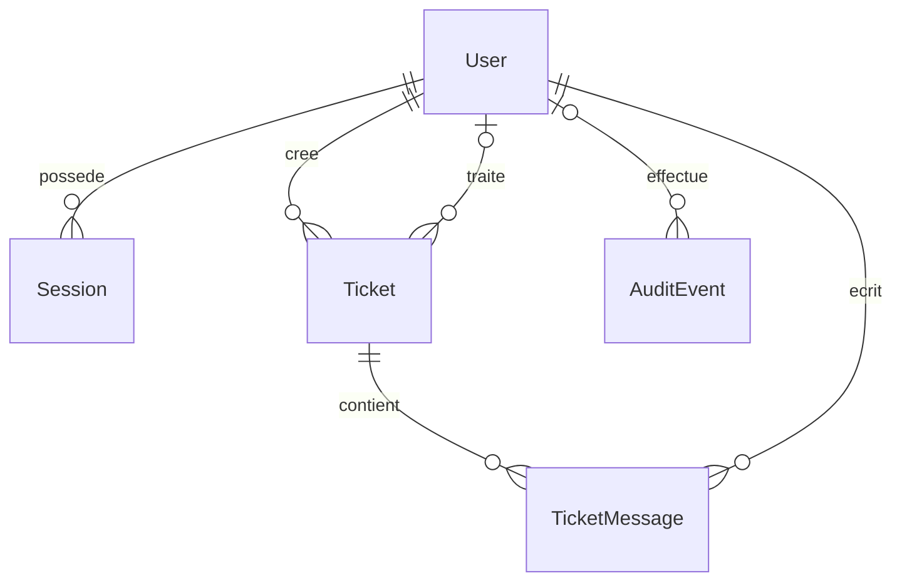

# Décisions d’architecture

## Monorepo

Workspaces npm : deux applications et des DTO TypeScript indépendants dans `packages/contracts`. Aucun modèle Prisma dans Angular. Le client Prisma généré est ignoré par Git ; la migration SQL et le verrou npm sont versionnés. Le CLI Prisma est une dépendance de développement de la racine pour appliquer les overrides transitifs de façon homogène.

Les overrides `deepmerge-ts` et `mysql2` corrigent des dépendances du CLI Prisma 7.10. Génération, migrations et tests vérifient leur compatibilité. Les réévaluer à chaque mise à jour et les supprimer lorsque les correctifs sont intégrés en amont.

## Responsabilités

Routes : validation Zod et traduction HTTP. Middlewares : authentification, rôles, origines et limites. Services : gestion des sessions, accès aux tickets et transactions. Politique pure : lecture, gestion et transitions de tickets. Prisma est utilisé directement, sans couche repository qui recopierait ses méthodes. L’audit accepte le client transactionnel pour que la trace accompagne le changement métier.

Les transactions de mutation verrouillent la ressource. Contraintes uniques et clés étrangères protègent également les données. Les erreurs techniques ne sont jamais sérialisées dans les réponses.

## Modèle relationnel

UUID publics, emails normalisés uniques, enums pour rôle, état, statut, priorité et visibilité. Dates UTC et affichage local côté navigateur. Index sur auteur/date, attribution/statut, sessions/utilisateur, conversation/date et audit/date. Aucune suppression d’utilisateur dans la V1.

## Frontend

Composants autonomes chargés à la demande. L’initializer attend la restauration de session ; les guards contrôlent ensuite identité et rôles. Signals pour l’état affiché, RxJS pour HTTP et le renouvellement partagé. Le service Auth conserve la seule copie de l’access token.

Les pages sont regroupées par fonction sans bibliothèque de composants ni store supplémentaire. Les styles SCSS communs harmonisent formulaires, badges et focus. Les confirmations natives précisent les conséquences des révocations, modifications de comptes et fermetures.

## Déploiement visé

Un reverse proxy HTTPS sert Angular et proxifie `/api` vers Express, qui accède à PostgreSQL privé. Node écoute sur loopback par défaut ; HOST=0.0.0.0 permet un conteneur. Les limiteurs conviennent à une instance unique ; plusieurs instances demandent des compteurs partagés et une gestion coordonnée des clés.

GitHub Actions décrit la vérification reproductible. Son exécution sur GitHub dépendra d’une publication volontaire : aucun dépôt distant ni déploiement n’a été créé.
