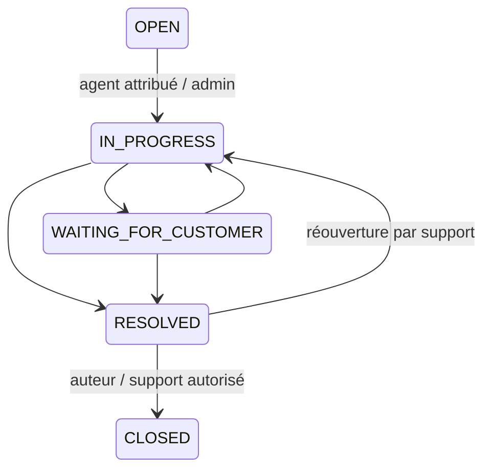

# Autorisations et états métier

Politique de refus par défaut. `authenticate` vérifie le JWT puis charge une session non révoquée et non expirée, et un utilisateur actif. `roles` limite les catégories d’acteurs. `tickets/policy.ts` et le filtrage Prisma appliquent la propriété ; aucun identifiant public n’est une permission.

| Opération                            | CUSTOMER                      | AGENT                                  | ADMIN                         |
| ------------------------------------ | ----------------------------- | -------------------------------------- | ----------------------------- |
| Inscription publique                 | Compte CUSTOMER seulement     | Non configurable                       | Non configurable              |
| Profil / sessions                    | Les siens                     | Les siens                              | Les siens                     |
| Révocation personnelle / globale     | Oui                           | Oui                                    | Oui                           |
| Créer un ticket                      | Oui                           | Non                                    | Non                           |
| Lire ticket / messages publics       | Auteur                        | Non attribué ou attribué à lui         | Tous                          |
| Liste / recherche / compteur         | Auteur, filtre SQL            | Même périmètre, filtre SQL             | Tous                          |
| Prendre en charge                    | Non                           | Non attribué, non CLOSED               | Idem                          |
| Réponse publique                     | Auteur, ni RESOLVED ni CLOSED | Attribué à lui, ni RESOLVED ni CLOSED  | Tous, ni RESOLVED ni CLOSED   |
| Lire note interne                    | Jamais                        | Ticket lisible                         | Tous                          |
| Ajouter note interne                 | Jamais                        | Attribué à lui, conversation ouverte   | Conversation ouverte          |
| Changer priorité                     | Non                           | Attribué à lui, non CLOSED             | Non CLOSED                    |
| Changer statut                       | RESOLVED → CLOSED, auteur     | Attribué à lui, transitions ci-dessous | Transitions ci-dessous        |
| Attribuer / réattribuer / libérer    | Non                           | Non                                    | Agent ou admin actif, ou null |
| Utilisateurs / rôles / désactivation | Non                           | Non                                    | Oui, protection dernier admin |
| Révoquer sessions tierces            | Non                           | Non                                    | Oui                           |
| Journal d’audit                      | Non                           | Non                                    | Oui                           |

Un agent voit les tickets non attribués pour choisir ceux qu’il prend en charge ; il doit les réclamer avant de répondre, de changer la priorité ou le statut. Une réattribution peut immédiatement retirer sa visibilité.

## Transitions

`CLOSED` est terminal. La prise en charge passe automatiquement de OPEN à IN_PROGRESS. Réattribuer ne change pas le statut. Un client peut envoyer un message en attente mais le statut reste sous contrôle de l’agent. RESOLVED bloque les nouveaux messages jusqu’à réouverture. CLOSED bloque messages, priorité, prise en charge et changement de statut ; l’administrateur peut toujours corriger l’attribution pour le suivi historique.

## Concurrence et administration

- Verrou de ligne PostgreSQL sur le ticket avant toute mutation : deux agents ne gagnent pas une même prise en charge.
- Verrou transactionnel consultatif commun aux changements de rôle/état : deux administrateurs ne peuvent pas se rétrograder simultanément en supprimant le dernier administrateur actif.
- Tout changement de rôle révoque les sessions, même une promotion. L’utilisateur doit se reconnecter.
- Une désactivation révoque les sessions. Une désactivation ou le passage à CUSTOMER libère les tickets attribués pour éviter de les rendre inaccessibles au support.
- Pas de suppression d’utilisateur dans cette version. Le dernier administrateur ne peut être ni désactivé ni rétrogradé.
- Modifications sensibles et audit appartiennent à la même transaction.

## Réponses et confidentialité

401 pour JWT invalide, session expirée/révoquée ou compte désactivé ; 403 pour action non autorisée, ticket existant hors périmètre ou origine refusée ; 404 pour identifiant absent ; 409 pour transition ou concurrence incompatible ; 422 pour schéma invalide.

Le choix de 403 sur un ticket existant révèle son existence à un utilisateur authentifié connaissant l’UUID, mais aucune donnée du ticket. Une application à exigences plus strictes pourrait uniformiser en 404. Les notes internes sont exclues par la condition Prisma avant sérialisation. Les DTO utilisateurs ne sélectionnent jamais `passwordHash`. Les DTO sessions ne sélectionnent jamais `secretHash`.
